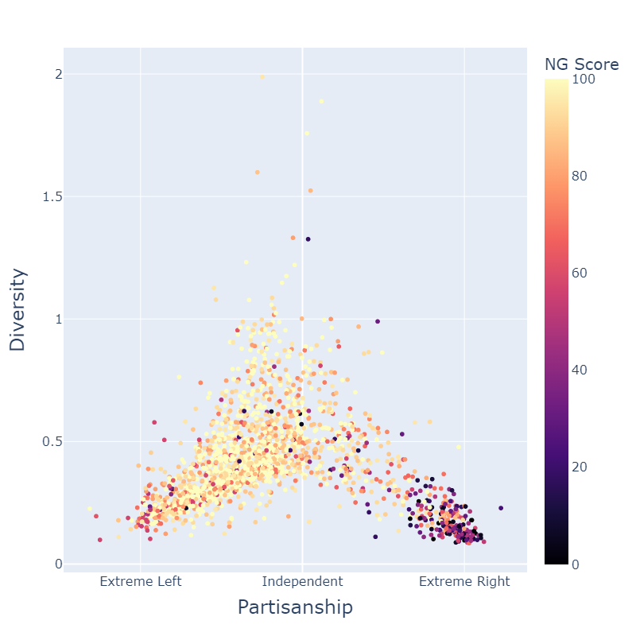
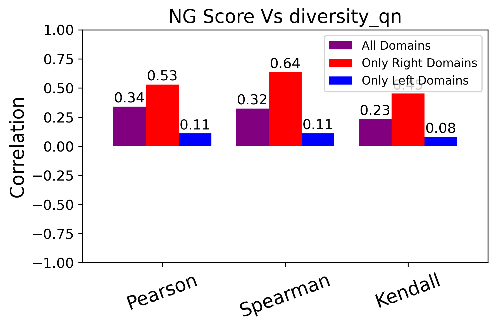
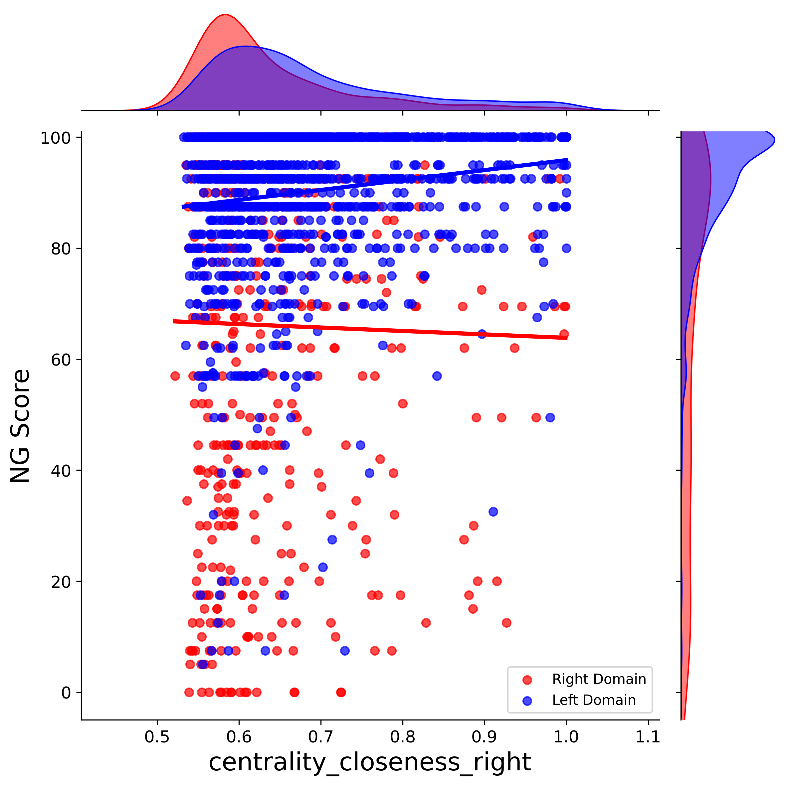

# Exogenous-Cues-Pipeline
This is the pipeline where we examined candidate cues of information quality.
## ▶ Video

## 📖 Introduction [(SoMe4Dem)](https://some4dem.eu/consortium)
Democracy in the 21st century is facing challenges, with the **public sphere** — the space for political discussion — changing in concerning ways. Social media plays a dual role:

- **Positive:** Platforms like Twitter/X and Facebook make political debate more open and accessible.  
- **Negative:** They create echo chambers, fragment discussion, weaken civil debate norms, and reduce trust in institutions.  

This project addresses the issue from three perspectives:
1. Collecting stronger evidence about how social media affects political debates and society.  
2. Understanding the mechanisms behind these effects.  
3. Developing tools to help social media better support democracy — improving debate, building legitimacy, and strengthening democratic citizenship.  

---

## 🧩 The Problem
Social media platforms rely on **engagement-driven recommender systems**, usually powered by collaborative filtering. These systems:
- Maximize clicks, likes, and shares rather than information quality.  
- Promote misinformation, gossip, or sensational content as effectively as fact-based reporting.  

Filtering content directly for quality is computationally expensive, difficult to scale, and raises censorship concerns.  

✅ **Our alternative:** Use **exogenous cues** (contextual signals) as proxies for information quality.  
Example: A news domain with a politically diverse audience is more likely to be reliable.  

  
  

---

## 🎯 Project Goals
Our research is structured into two main phases:  

### Phase 1 — Identifying Useful Exogenous Cues
We tested several cues against **NewsGuard** scores (0–100 reliability ratings by professional journalists).  
Cues that showed significant correlation with NewsGuard ratings were retained as predictors.

Explored exogenous cues:
- Political diversity of a domain’s broadcasters  
- Popularity of domains  
- Skewness of broadcaster distribution  
- Skewness of article distribution  
- Cognitive centrality of domains (multiple variants)  

  

### Phase 2 — Building an Augmented Recommender System
We integrated the strongest cues into standard recommendation algorithms to create an **augmented model**.  
This approach improves recommendation quality without directly filtering or censoring content.  

Datasets:
- Twitter/X data from the **US** and **Germany**  
- Included users’ partisanship, allowing analysis of how domains spread across the political spectrum  

---

## 📊 Modeling & Results
We framed prediction as a **regression task**: estimating NewsGuard scores from contextual cues.  

Models used:
- **Random Forest** → captured non-linear relationships, robust against noisy signals  
- **Elastic Net** → interpretable, identified the most relevant features while reducing redundancy
  
### Elastic Net MAE Comparison (US vs Germany)

  
  

### Random Forest MAE Comparison (US vs Germany)

  
  

### Key insights:
- Random Forest achieved strong predictive performance.  
- Elastic Net revealed which contextual cues most consistently influenced information quality.  
- Together, they balanced **accuracy and interpretability**.  

### Explainability:

---
