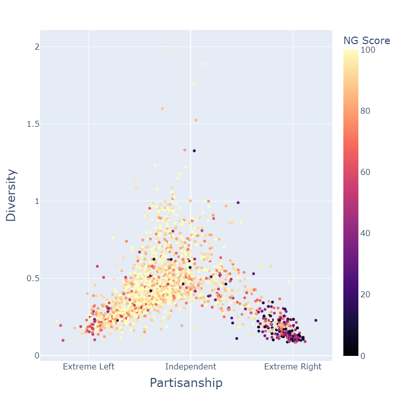
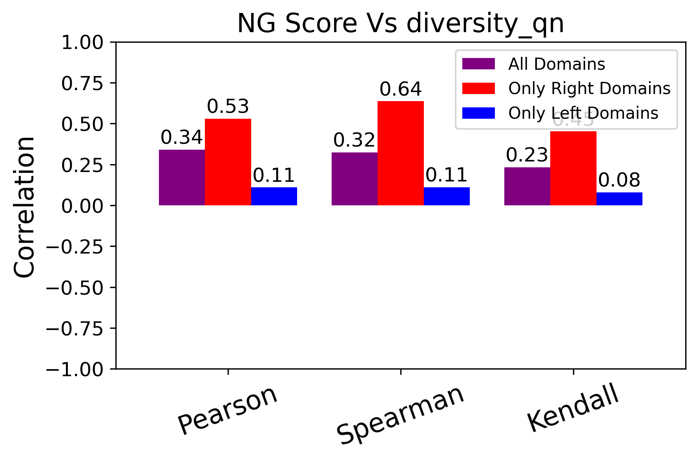
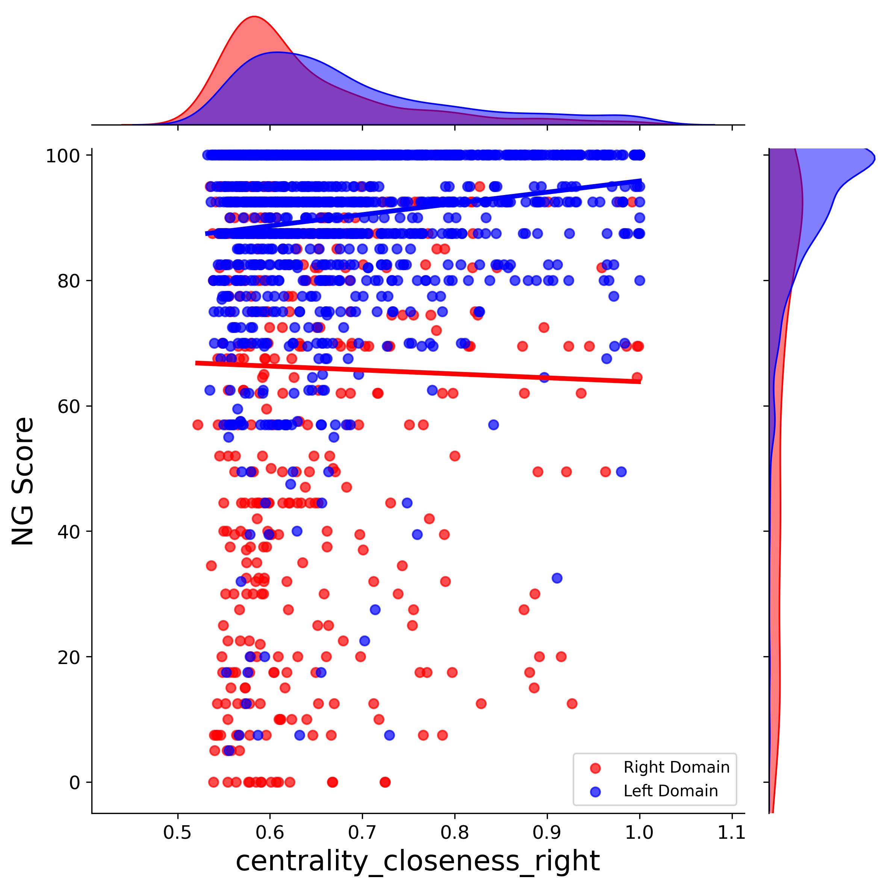
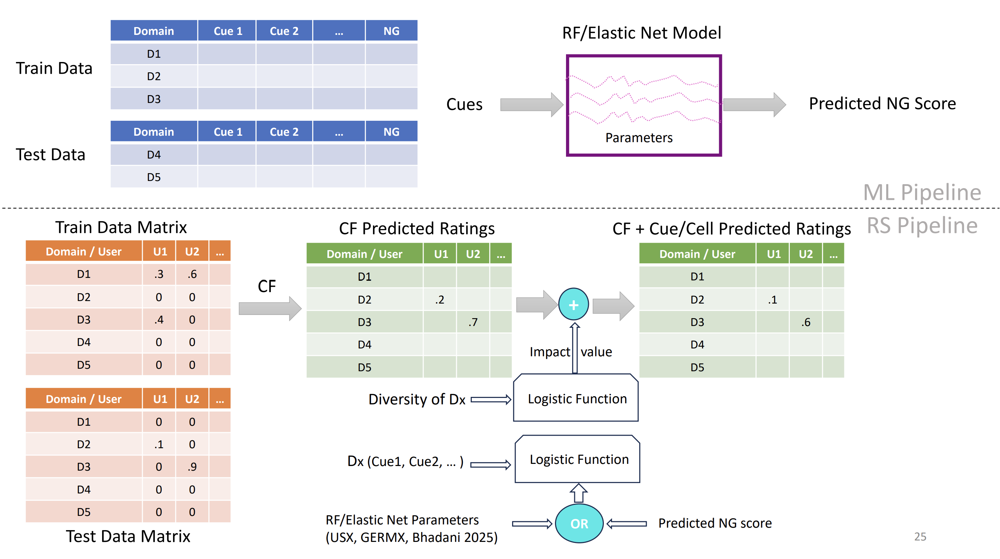
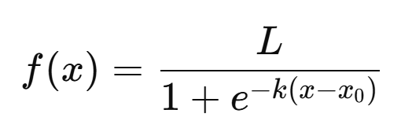
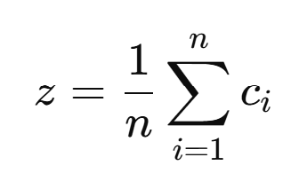
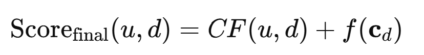

### Funding & Acknowledgements

This project is developed as part of the **SoMe4Dem** (Social Media for Democracy) research project, funded by the European Union under the Horizon Europe programme (Grant No. 101094752).

SoMe4Dem brings together an interdisciplinary consortium of European research institutions, including the Max Planck Institutes, University of Amsterdam, Sciences Po, and others, to study the impact of social media on political discourse and democracy.

The project aims to better understand how information spreads in online environments and to develop tools that improve the quality of information and support healthier public debate.

# Recommender Systems for Quality Political News Source
A complete, end-to-end pipeline for improving the quality of news recommendations without direct content filtering. Instead of classifying content, it uses exogenous cues (contextual, network, and audience signals) as proxies for information quality, validates them against NewsGuard (0–100), then injects the strongest cues into a recommender as a quality-aware adjustment layer.

## ▶ Video

---

## 📖 Introduction [(SoMe4Dem)](https://some4dem.eu/consortium)
Democracy in the 21st century is undergoing rapid transformation. The **public sphere**, where political discussion takes place, has increasingly shifted to digital platforms — bringing both opportunities and risks.

### Social media’s dual role:
- **Positive:** Platforms like Twitter/X and Facebook make political debate more accessible and inclusive.  
- **Negative:** They also fuel echo chambers, amplify sensational or low-quality content, erode trust, and weaken shared norms of civic discourse.

### The SoMe4Dem project addresses these challenges by:
1. Building stronger empirical evidence about how social media shapes political debate.  
2. Identifying mechanisms that distort information exposure.  
3. Developing tools and models that help platforms support healthier democratic engagement.  

---

## 🧩 The Problem
Most modern recommender systems — typically built on collaborative filtering — optimize **user engagement**, not **information quality**. As a result, they:

- Favor highly clickable content over informative or trustworthy content  
- Treat misinformation and reliable reporting as equally valuable (if both drive engagement)  
- Are difficult to regulate or “correct” without raising censorship concerns  

Because direct content filtering is computationally heavy and politically sensitive, we explore an alternative approach:

### ✅ **Use exogenous cues (contextual signals) as proxies for information quality.**
For example:  
→ A domain whose audience is **politically diverse** is, on average, more trustworthy.

  
  

---

## 🎯 Project Goals

### **Phase 1 — Identifying Useful Exogenous Cues**
We evaluated a variety of contextual cues against **NewsGuard** quality ratings (0–100).  
Cues with strong and consistent correlation were kept as predictors.

**Explored cues:**
- Political audience diversity  
- Domain popularity  
- Broadcaster distribution skew  
- Article distribution skew  
- Multiple cognitive centrality measures  

  

---

### **Phase 2 — Building an Augmented Recommender System**
We built a recommender system that integrates the strongest cues into standard algorithms, improving quality exposure **without filtering content**.

**Datasets:**
- Twitter/X data from the **US** and **Germany**  
- Includes user partisanship and broadcaster–domain relationships  

---

## 📊 Modeling & Results

We formulated cue evaluation as a **regression task** predicting NewsGuard scores.

### **Models used**
- **Random Forest** → excellent at uncovering complex, non-linear cue relationships  
- **Elastic Net** → interpretable, identifies the most relevant cues while reducing redundancy  

### Elastic Net MAE Comparison (US vs Germany)

  
  

### Random Forest MAE Comparison (US vs Germany)

  
  

### **Key insights**
- Random Forest consistently delivers strong predictive accuracy  
- Elastic Net highlights robust, interpretable cue patterns  
- Together, they offer a balance of performance + explainability  
---

# 🧠 Cue Explainability
Feature importance (RF) and coefficient analysis (ENet) reveal that cues related to:

- political diversity,  
- distribution skewness, and  
- cognitive centrality  

are the strongest and most reliable predictors of information quality.  
These insights directly shaped how cues are incorporated into the recommender.

---

# 🏗 Recommender System Pipeline
Beyond predicting NewsGuard scores, we developed a **complete recommender system pipeline** following the architecture described below 

  

## **1️⃣ User–Domain Matrix Construction**
We aggregate broadcasters and domains to build a sparse matrix of user–domain interactions.  
Because some domains dominate the distribution, we apply:

- **TF–IDF transformation**  
- Optional normalization  

This yields a more informative signal for collaborative filtering.

---

## **2️⃣ Baseline Recommender Models**
We implement several baseline algorithms:

- **Global Popularity Ranking**  
- **Collaborative Filtering (CF)**  
- **CF + Diversity**  
- **CF + Exogenous Cues (our augmented model)**  

The CF model defines user relevance; the augmented models layer additional quality awareness on top.

---

## **3️⃣ Quality Cue Prediction Layer**
To determine how cues influence quality, we use:

- **Elastic Net coefficients**  
- **Random Forest feature importances**

These learned parameters are later used to weight cues when re-ranking recommendations.

---

---

## 🔢 Logistic Transformation of Cues

To incorporate information-quality cues into the recommender system, we map cue values into a bounded “impact” term using a **logistic function**. This lets us smoothly adjust the CF-predicted rating without manually clipping or thresholding values.

### Single-cue logistic transformation

For a single cue value (x) (e.g., diversity of a domain), we use:

  

where:

| Parameter | Meaning      | Effect                             |
|----------|--------------|------------------------------------|
| **L**    | Upper limit  | Maximum impact value               |
| **k**    | Growth rate  | Controls curve steepness           |
| **x₀**   | Midpoint     | Shifts the curve left / right      |
| **x**    | Cue value    | Position on the curve              |

---

### Multi-cue logistic transformation (combined cues)

For multiple cues, we first **combine the cues into a single scalar value** and then apply *one* logistic function.

#### 1) Equal-weight combination

All cues contribute equally:

  

#### 2) Learned-weight combination

We also use **learned importance weights** from our ML models (Elastic Net coefficients or Random Forest feature importances):

  

In both cases, the combined value (z) is passed through the same logistic function:

  

---

### Cue-augmented recommendation score

The logistic output acts as an impact term that adjusts the collaborative-filtering prediction:

  

where \(CF(u,d)\) is the baseline collaborative-filtering score and (f({c}_d)) is the quality-aware adjustment computed from the domain’s cues using either **equal** or **learned** weights.

---

## **5️⃣ Evaluation**

**Metrics:**
- Precision@K  
- RMSE  
- Kendall Tau (ranking consistency)  
- Trustworthiness (NewsGuard score of recommendations)  

### Findings:
- Cue-augmented models significantly increase **information quality**  
- Personalization remains stable (minimal precision loss)  
- TF–IDF preprocessing improves CF performance  

---

# 🧪 Summary
This project demonstrates that:

- Exogenous cues can reliably approximate information quality.  
- Learned model parameters can drive **logistic cue weighting**, making the system data-driven rather than manually tuned.  
- Quality-aware recommender systems can improve user information exposure **without restricting or censoring content**.  

The repository includes the complete pipeline: cue extraction, model training, recommender algorithms, logistic re-ranking, and evaluation.

# 🤝 Team

  

# 🚧 Data Availability
Access can be provided **upon request**.
